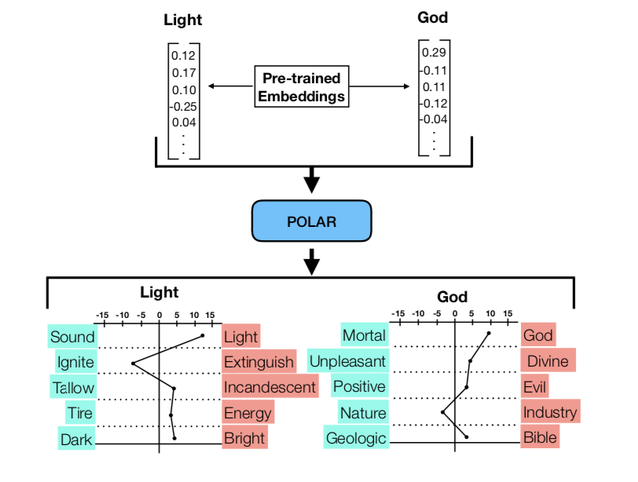

# The POLAR Framework: Polar Opposites Enable Interpretability of Pre-Trained Word Embeddings

> The POLAR Framework: Polar Opposites Enable Interpretability of Pre-Trained Word Embeddings. Binny Mathew, Sandipan Sikdar, Florian Lemmerich, and Markus Strohmaier accepted at [The Web Conference (WWW) 2020](https://www2020.thewebconf.org/).

***Please cite our paper in any published work that uses any of these resources.***

~~~
@inproceedings{mathew2020polar,
  title={The POLAR Framework: Polar Opposites Enable Interpretability of Pre-Trained Word Embeddings},
  author={Mathew, Binny and Sikdar, Sandipan and Lemmerich, Florian and Strohmaier, Markus},
  booktitle={Proceedings of The Web Conference 2020},
  pages={1548--1558},
  year={2020}
}
~~~

## Abstract
We introduce ‘POLAR’ — a framework that adds interpretability to pre-trained word embeddings via the adoption of semantic dif- ferentials. Semantic differentials are a psychometric construct for measuring the semantics of a word by analysing its position on a scale between two polar opposites (e.g., cold – hot, soft – hard). The core idea of our approach is to transform existing, pre-trained word embeddings via semantic differentials to a new “polar” space with interpretable dimensions defined by such polar opposites. Our framework also allows for selecting the most discriminative di- mensions from a set of polar dimensions provided by an oracle, i.e., an external source. We demonstrate the effectiveness of our framework by deploying it to various downstream tasks, in which our interpretable word embeddings achieve a performance that is comparable to the original word embeddings. We also show that the interpretable dimensions selected by our framework align with human judgement. Together, these results demonstrate that interpretability can be added to word embeddings without com- promising performance. Our work is relevant for researchers and engineers interested in interpreting pre-trained word embeddings.

The framework takes pre- trained word embeddings as an input and generates word embeddings with interpretable (polar) dimensions as an out- put. In this example, the embeddings are generated by ap- plying POLAR to embeddings pre-trained on Google News dataset with Word2Vec.

## Requirements
  
  1. Numpy
  2. Sklearn
  3. Tqdm
  4. Gensim
  5. Nltk

## Running the code

Results can be obtained using the main notebook (main.ipynb)

The code is commented for ease of use

### Embeddings Files
The links for the embeddings used -
* http://nlp.stanford.edu/data/glove.42B.300d.zip (glove)
* https://drive.google.com/file/d/0B7XkCwpI5KDYNlNUTTlSS21pQmM/edit?usp=sharing (word2vec)
